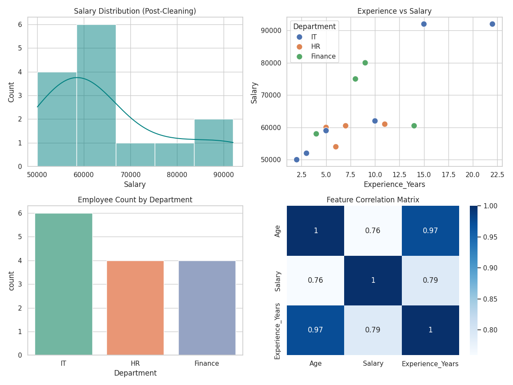

# Data Preprocessing, Cleaning & Visual Exploratory Analytics Pipeline

## 📌 Executive Summary
This repository contains a complete end-to-end Data Preprocessing and Analytics Pipeline built in Python using Pandas, NumPy,Matplotlib, and Seaborn inside Google Colab.

The project processes a raw transactional employee dataset by removing duplicate records, imputing missing feature values, capping extreme outliers using the Interquartile Range (IQR) technique, and generating exploratory data visualizations.

---

## 🛠️ Data Pipeline Architecture

### 1. Data Ingestion & Profiling
- Ingested raw structural dataset containing missing records and extreme values.
- Evaluated initial feature shapes, missing null counts, and data types.

### 2. Data Cleaning & Preprocessing
- *Deduplication:* Identified and dropped duplicate entries to prevent model bias.
- *Missing Value Imputation:*
  - *Numerical Features (Age, Salary):* Imputed nulls using *Median Imputation*.
  - *Categorical Features (Department):* Imputed nulls using *Mode Imputation* (most frequent class).
- *Outlier Capping (IQR Method):*
  - Applied lower and upper bounds to cap extreme salary values without losing observation rows.

---

## 📊 Visual Analytics Dashboard

### Key Insights from Visualizations:
1. *Salary Distribution:* Right-skewed salary metrics normalized following IQR capping.
2. *Experience vs Salary:* Strong positive correlation observed between total experience years and compensation scale.
3. *Department Distribution:* IT holds the largest share of total headcount, followed by HR and Finance.
4. *Correlation Matrix:* High collinearity confirmed between Age and Experience_Years.

---

## 📁 Repository Structure
